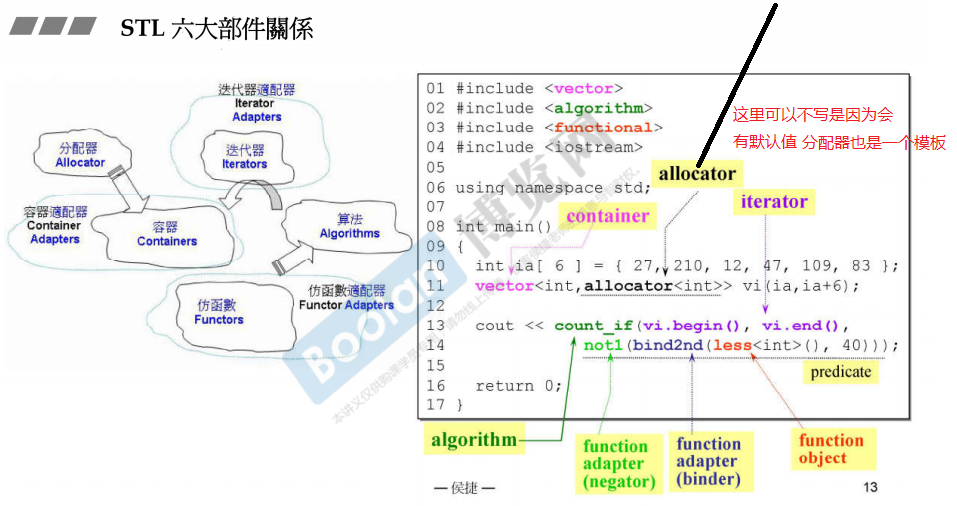
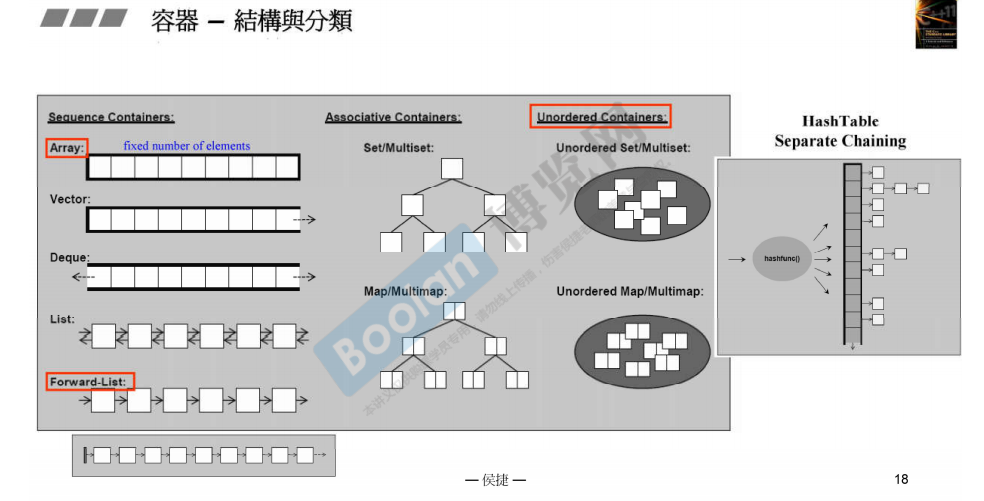

# video_2~4-STL体系结构基础及各种容器

[TOC]

## 1.STL的六个部分

- 容器(containers)
- 分配器(allocators)
  - 容器要放东西，东西要占用内存，因此需要分配器来支持容器
- 算法(algorithms)
  - 对容器中的东西进行操作
- 迭代器(iterators)
  - **就像是泛化的指针，是算法和容器的桥梁**
- 适配器(adaptors)
  - 对东西进行转换
- 仿函数(functors)
  - 作用就像是一个函数

## 2.STL六部分的示例



## 3.容器规定--pff by one, pass the end 

即：

- 迭代器的头指针指向第一个元素
- 迭代器的末尾指针指向尾部元素的下一个元素
- 可以理解为前闭后开，即begin是可以被访问的，但是end是不可以访问的 

## 4. Range-based statement

范围for : **会把冒号右边的容器元素的逐个取出**

```c++
    for (int i : {2,3,5,7,9,13,17,19})
    {
        std::cout << i <<endl;
    }
```

## 5. auto推断变量类型

还是需要清楚变量到底是什么类型!

## 6.容器的结构概况



 

## 7. Array

```c++
array.data() //返回的是array的首元素地址
qsort(首元素地址, 数组长度, 一个元素占用内存的大小, 比较函数)
```

## 8.写测试程序的经验

每类不同的测试程序定义在不同的namespace里面。然后每个namespace用到的头文件，写在这个space上面，因为有保护机制，因此不怕重复include。
